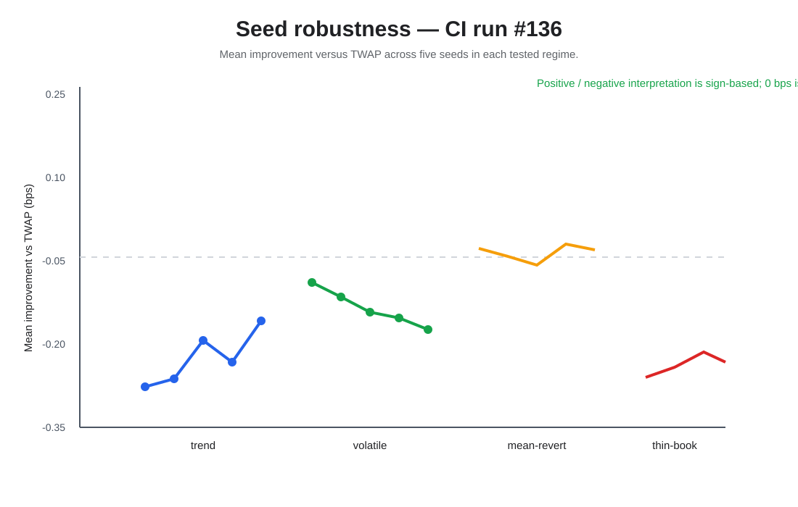
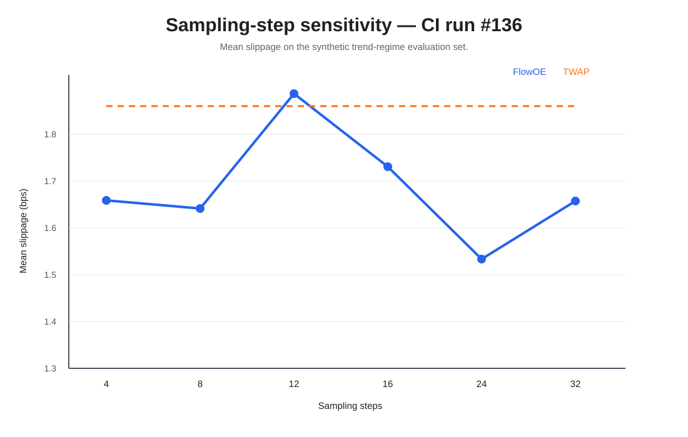
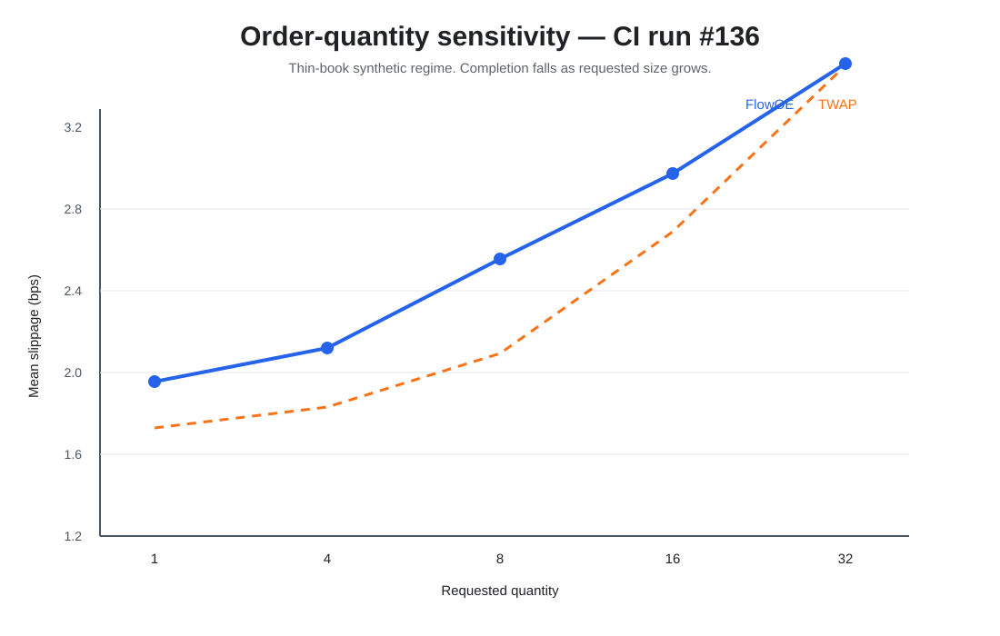
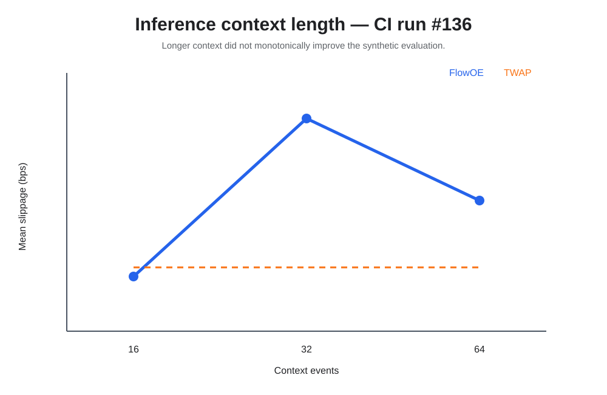
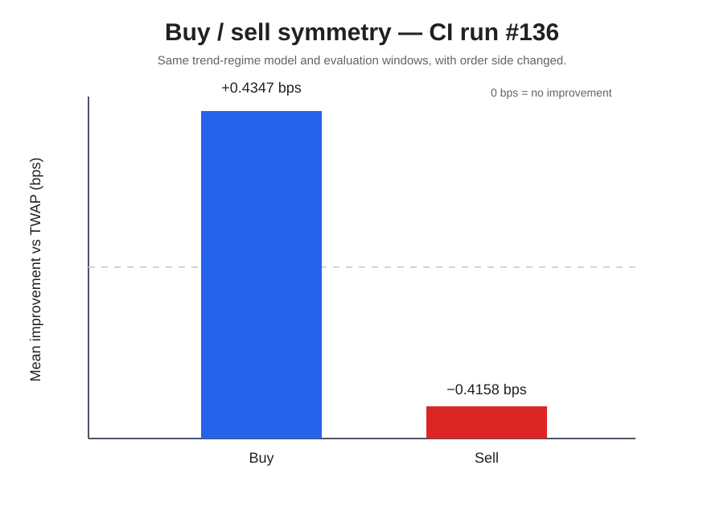
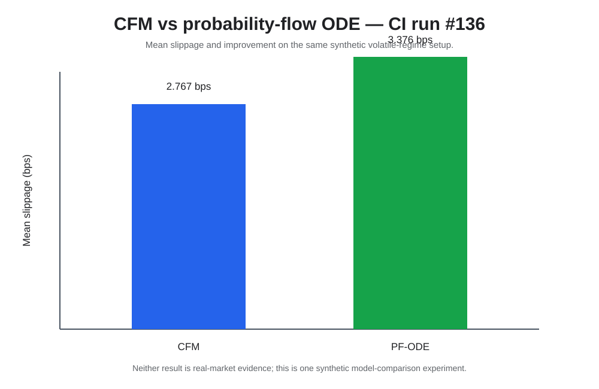

# FlowOE Execution

A PyTorch research project for generating order-execution schedules from limit-order-book data, replaying them against real book depth, and measuring execution quality.

## What this project does

FlowOE has one clear flow:

**market data → features → flow model → execution schedule → L2 replay → slippage / completion**

It includes:

- Conditional Flow Matching (CFM) for schedule generation.
- A probability-flow ODE model for comparison.
- 45-value top-10 L2 features.
- FI-2010 auxiliary training for market-microstructure information.
- Full top-10 book replay with partial fills.
- Trade VWAP and TWAP comparisons.
- Synthetic smoke tests and a larger synthetic analysis suite.
- Real-data validation and Binance depth reconstruction.
- Optional CUDA and TensorRT acceleration.


## Project structure


The main code is:

```text
src/flowoe_execution/
├── data.py        FI-2010, L2 and trade loading
├── features.py    45-value L2 feature builder
├── model.py       CFM, PF-ODE and fixed-step sampler
├── execution.py   full-depth execution replay
├── metrics.py     summary statistics and bootstrap CI
├── ode.py         RK4 ODE integration
└── cuda/          fused CUDA update

scripts/
├── run_experiment.py
├── evaluate_execution_grid.py
├── run_execution_sweep.py
├── run_analysis_suite.py
├── validate_real_data.py
├── reconstruct_binance_t_depth.py
├── download_fi2010.py
├── download_binance_trades.py
├── build_trt_engine.py
├── benchmark_latency.py
├── benchmark_trt.py
└── benchmark_cuda_fused.py

tests/
docs/
```

## Requirements

For the normal CPU path:

- Python 3.10+
- pip
- Git

Python 3.11 is used in CI.

CUDA, TensorRT and a CUDA compiler are only needed for the acceleration path.

No API key is needed for the smoke test.

## Install

### Linux / macOS

```bash
git clone https://github.com/SpryzenHell/flowoe_execution.git
cd flowoe_execution

python -m venv .venv
source .venv/bin/activate

python -m pip install --upgrade pip
python -m pip install -e '.[test]'
```

### Windows PowerShell

```powershell
git clone https://github.com/SpryzenHell/flowoe_execution.git
cd flowoe_execution

python -m venv .venv
.venv\\Scripts\\Activate.ps1

python -m pip install --upgrade pip
python -m pip install -e '.[test]'
```

## Run the tests

```bash
python -m pytest -q
```

The CI workflow also:

1. compiles the Python sources;
2. runs the test suite with line coverage;
3. runs the smoke experiment;
4. runs the extended analysis suite;
5. uploads the analysis files.

The recorded CI #136 snapshot passed compilation, the test suite, the smoke experiment, the analysis suite, and the analysis upload.


## Run a smoke experiment

This is the fastest end-to-end check and uses only synthetic data.

```bash
python scripts/run_experiment.py --smoke --epochs 12
```

The smoke run:

1. creates a synthetic ten-level book and trade stream;
2. builds 45-value L2 features;
3. trains the CFM policy;
4. trains the FI-2010 auxiliary head;
5. generates a schedule;
6. replays the schedule against the book;
7. compares FlowOE with TWAP;
8. writes the model and JSON report under `results/`.

The smoke run uses fixed random seeds.

## Recorded synthetic smoke check

A recorded CI smoke run produced:

| Metric | TWAP | FlowOE |
|---|---:|---:|
| Mean slippage (bps) | 1.27657 | 1.24115 |
| Median slippage (bps) | 1.18479 | 1.14619 |
| p95 slippage (bps) | 2.87290 | 2.96368 |
| Mean completion | 1.0000 | 1.0000 |

Mean difference: **0.03541 bps** in favour of FlowOE on this synthetic run.


These numbers are regression-test results on synthetic data. They are not real-market performance.

## Extended analysis

Use the larger analysis suite for model-development checks:

```bash
make install-analysis
make analysis
```

The standard command covers:

| Test area | Settings |
|---|---|
| Market regimes | 7 |
| CFM seeds | 7, 17, 27, 37, 47 |
| CFM seed fits | 20 |
| Schedule families | 5 × 7 regimes |
| Sampling steps | 4, 8, 12, 16, 24, 32 |
| Order sizes | 1, 4, 8, 16, 32 |
| L2 depth | 1, 3, 5, 10 levels |
| Context length | 16, 32, 64 |
| Order side | buy, sell |
| Model comparison | CFM vs probability-flow ODE |

The suite writes CSV and PNG files under `docs/results/analysis/`.

It checks:

- different market conditions;
- different random seeds;
- different schedule families;
- solver-step changes;
- order-size changes;
- available book depth;
- context length;
- buy/sell behavior;
- CFM vs PF-ODE.

### Analysis snapshots















These figures are synthetic analysis snapshots. They are meant to show model and simulator behavior, not real-market results.

The checked CI #136 analysis snapshot is documented in [docs/results/analysis/CI_RUN_136.md](docs/results/analysis/CI_RUN_136.md).

## Execution replay

For each child order, the simulator walks the configured book depth from best price outward.

It records:

- requested quantity;
- executed quantity;
- average execution price;
- benchmark VWAP;
- slippage in basis points;
- completion;
- number of price levels used.

For a buy:

```text
slippage_bps = (execution_price - benchmark_vwap)
                / benchmark_vwap × 10,000
```

For a sell, the sign is reversed.

The simulator does not assume that the best quote has unlimited size.

## L2 features

The current L2 feature vector has 45 values:

- 10 bid-price deviations;
- 10 ask-price deviations;
- 10 log bid sizes;
- 10 log ask sizes;
- relative spread;
- microprice deviation;
- order-book imbalance;
- rolling volatility;
- order-flow imbalance.

The feature builder checks the expected shape and returns finite values.

## FI-2010 auxiliary task

The FI-2010 loader expects:

- 144 feature columns;
- 5 label columns.

The auxiliary head predicts three movement classes at five horizons.

Accepted label formats are:

- 1 / 2 / 3
- 0 / 1 / 2
- -1 / 0 / 1

FI-2010 is used as an auxiliary market-microstructure task. It is not an execution-price series.

## Real-data workflow

A real run needs:

1. FI-2010 NoAuction ZScore data;
2. matching top-10 L2 snapshots;
3. matching trade prints.

### Validate the data

```bash
python scripts/validate_real_data.py \
  --fi data/real/fi2010/Train_Dst_NoAuction_ZScore_CF_7.txt \
  --l2 data/real/crypto/BTCUSDT_l2.csv \
  --trades data/real/crypto/BTCUSDT_trades.csv
```

The validator checks:

- FI shape and finite values;
- FI label format;
- valid L2 top-of-book prices;
- non-negative displayed sizes;
- positive trade price and quantity;
- overlap between the L2 and trade windows.

It writes:

```text
results/data_quality.json
```

### Run the real experiment

```bash
python scripts/run_experiment.py \
  --fi data/real/fi2010/Train_Dst_NoAuction_ZScore_CF_7.txt \
  --l2 data/real/crypto/BTCUSDT_l2.csv \
  --trades data/real/crypto/BTCUSDT_trades.csv \
  --epochs 120
```

The real-data path requires trade prints for the trade-VWAP result.

A book-VWAP proxy is available only when explicitly requested:

```bash
python scripts/run_experiment.py --help
```

Each real-data result records SHA-256 hashes of the input files.


## Reproducible real-data sampler sweep

For an end-to-end comparison, first reconstruct a contiguous Binance USD-M Futures book window with matching trade prints, then validate the files:

    python scripts/validate_real_data.py --fi data/real/fi2010/Train_Dst_NoAuction_ZScore_CF_7.txt --l2 data/real/crypto/BTCUSDT_l2.csv --trades data/real/crypto/BTCUSDT_trades.csv

Run three initialization/training seeds for both buy and sell, and compare the RK4 reference with fixed-step Euler at 2, 3, 4 and 6 grid points:

    python scripts/run_execution_sweep.py --fi data/real/fi2010/Train_Dst_NoAuction_ZScore_CF_7.txt --l2 data/real/crypto/BTCUSDT_l2.csv --trades data/real/crypto/BTCUSDT_trades.csv --seeds 7,17,27 --sides buy,sell --euler-steps 2,3,4,6 --epochs 20 --quantity 0.5 --train-ratio 0.60 --include-fused --out-dir results/execution_sweep

The sweep creates a distinct training report and checkpoint per seed/side, runs the sampler grid on the same held-out windows with matching initial noise, and retains per-episode outputs. It writes a run manifest and SWEEP_RESULTS.md under results/execution_sweep. If the fused extension fails to build or diverges by more than 1e-4 from the matching PyTorch Euler output, that configuration is excluded and the failure is recorded rather than discarding the other measurements.

The paired improvement interval resamples blocks of five consecutive execution episodes to reduce dependence between nearby windows. The sweep also reports variation across training seeds and completion rates. These are historical replay estimates against trade VWAP; they are not live exchange fills or a model of market impact.

## Leakage controls and evaluation rules

The 45-dimensional L2 feature builder now scales order-flow imbalance using a trailing 32-observation statistic, not a full-dataset statistic. This prevents future evaluation rows from influencing earlier OFI values. A prefix-invariance regression test changes only future book sizes and verifies that earlier features remain unchanged.

FI-2010 training windows keep the entire label horizon inside the chronological training split. The evaluator stores input hashes and training-report provenance, and uses the same latent noise for RK4 and every Euler configuration. Synthetic smoke results, real-data replay results and GPU inference timings must remain separate.


## L2 depth reconstruction

For Binance T_DEPTH-style data:

```bash
python scripts/reconstruct_binance_t_depth.py \
  --snapshot path/to/BTCUSDT_T_DEPTH_2022-11-01_depth_snap.csv \
  --updates path/to/BTCUSDT_T_DEPTH_2022-11-01_depth_update.csv \
  --out data/real/crypto/BTCUSDT_l2.csv \
  --interval-ms 100 \
  --quality-report results/depth_quality.json \
  --fail-on-gap
```

The script:

- applies set and delta updates;
- keeps the full working book;
- emits the best ten levels;
- handles seconds, milliseconds, microseconds and nanoseconds;
- checks update sequence IDs;
- can stop when a sequence gap is found.

Use a small file prefix for a parser test. Use a full continuous window for a real result.

## Trade data

The trade downloader supports daily Spot and USD-M Futures archives:

```bash
python scripts/download_binance_trades.py \
  --market um \
  --symbol BTCUSDT \
  --start 2025-01-01 \
  --end 2025-01-02 \
  --out data/real/crypto/BTCUSDT_trades.csv
```

The normalized output is:

```text
timestamp,price,qty,trade_id
```

The trade window must match the L2 evaluation window.

## TensorRT and CUDA

The acceleration path uses a fixed number of solver steps so the loop can be converted and benchmarked directly.

Install the optional acceleration dependencies on a CUDA-capable machine:

```bash
python -m pip install -e '.[accelerated]'
```

Build the TensorRT engine:

```bash
python scripts/build_trt_engine.py
```

Benchmark it:

```bash
python scripts/benchmark_trt.py --runs 500
```

The benchmark records:

- p50;
- p95;
- p99;
- mean speedup;
- output error;
- GPU and software versions.

The fused CUDA update can be built and measured with:

```bash
python scripts/build_cuda_extension.py
python scripts/benchmark_cuda_fused.py --steps 16 --runs 300
```

## Result checklist


The project does not turn a synthetic test into a real-market claim.

The resume targets:

- **2.4 bps improvement against VWAP**
- **<2 ms p99 TensorRT latency**

are not stored as measured results in the repository.

The 2.4 bps number needs a real data run with matching trade prints and a chronological evaluation split.

The <2 ms number needs a real CUDA/TensorRT benchmark on the target GPU.

## Data sources

### FI-2010

Official dataset metadata:

https://etsin.fairdata.fi/dataset/73eb48d7-4dbc-4a10-a52a-da745b47a649

The expected files are:

```text
Train_Dst_NoAuction_ZScore_CF_7.txt
Test_Dst_NoAuction_ZScore_CF_7.txt
Test_Dst_NoAuction_ZScore_CF_8.txt
Test_Dst_NoAuction_ZScore_CF_9.txt
```

### Binance

Public market-data portal:

https://data.binance.vision/

More details are in [DATA_SOURCES.md](DATA_SOURCES.md).

## Research procedure

For a real evaluation:

1. choose the instrument and dates;
2. prepare continuous top-10 L2 data;
3. prepare matching trade prints;
4. validate the data;
5. split the data by time;
6. train only on the earlier part;
7. generate schedules on later windows;
8. replay schedules against the full configured depth;
9. compute trade VWAP over the same window;
10. compare with TWAP;
11. save the result JSON and input hashes;
12. save hardware and software details for GPU tests.

## Generated files

These paths are ignored by Git:

```text
data/smoke/
data/real/
results/
.cache/
```

Market data and local experiment results are not stored in the repository.

## Further documentation

- [Getting started](docs/GETTING_STARTED.md)
- [Real-data run](docs/REAL_DATA_RUN.md)
- [Data sources](DATA_SOURCES.md)

## License

See [LICENSE](LICENSE).
