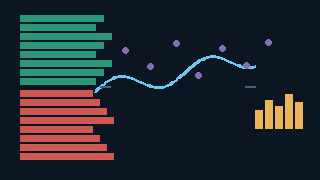
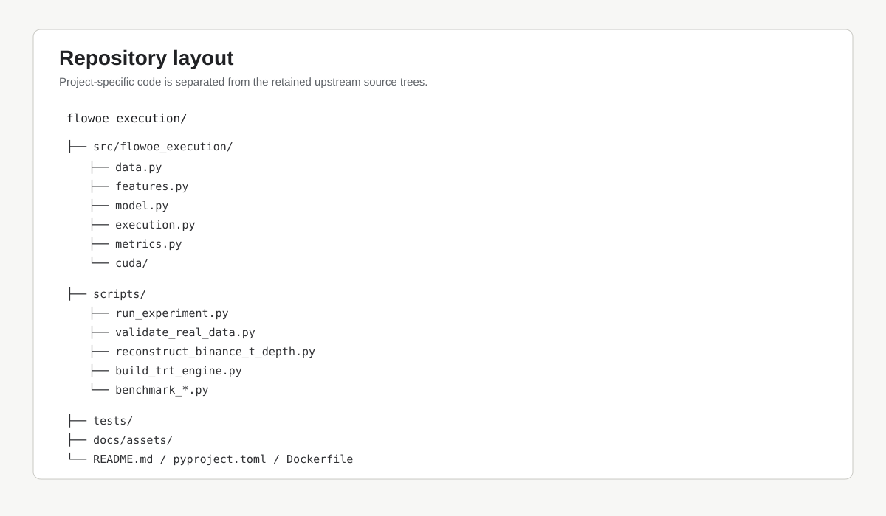
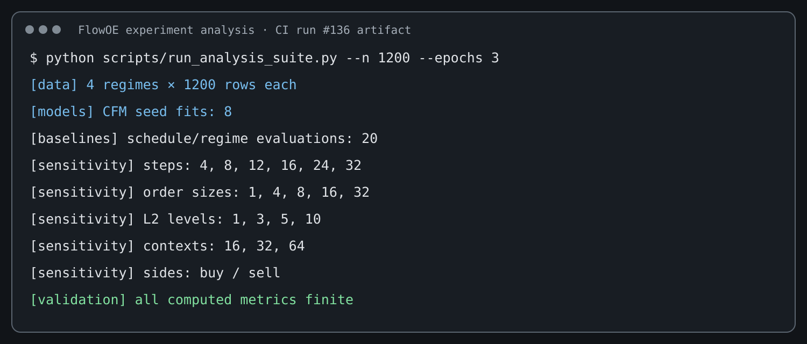
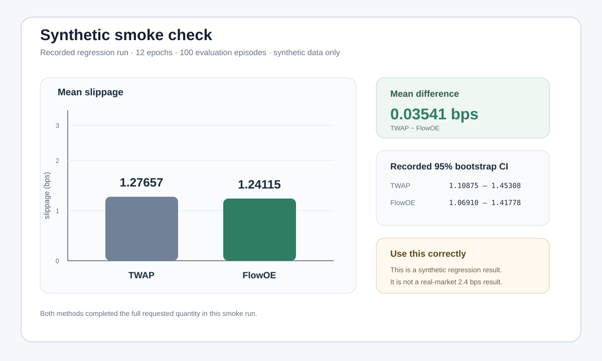
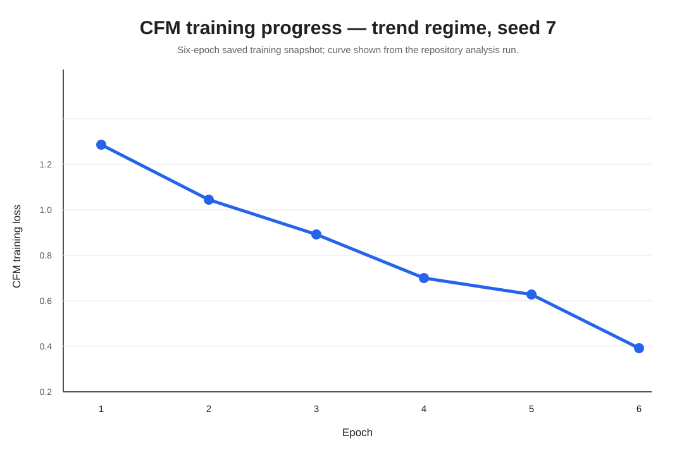
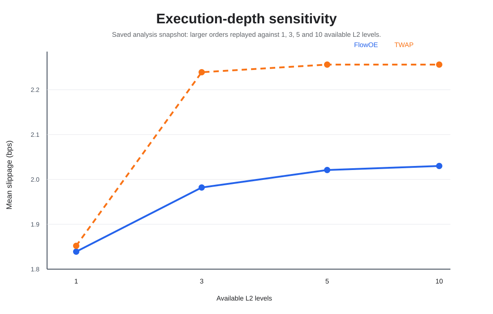
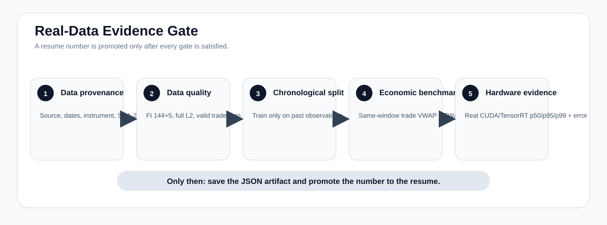
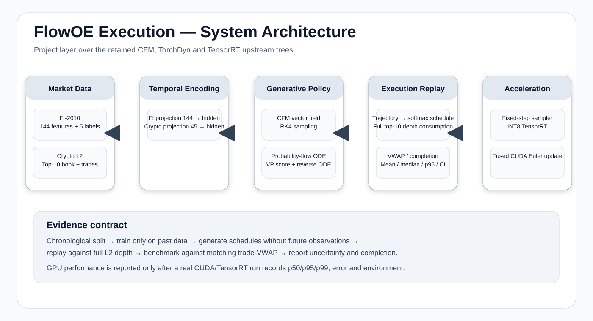

# FlowOE Execution



Conditional Flow Matching and Probability Flow ODE models for simulated order execution, with L2 replay and optional TensorRT/CUDA acceleration.

## Overview

FlowOE takes a short history of limit-order-book observations and produces an execution schedule over a fixed horizon. The schedule is replayed against a ten-level book so that available liquidity, completion, and execution price are measured explicitly.

The repository contains two model paths:

- Conditional Flow Matching (CFM) with RK4 sampling.
- A conditional variance-preserving score model with a reverse probability-flow ODE.

FI-2010 is used as an auxiliary microstructure task. Crypto L2 is the execution input. The execution layer compares the generated schedule with TWAP and, when matching trade prints are available, uses trade VWAP as the benchmark.

The project-specific implementation is under `src/flowoe_execution/`. The original upstream source trees are kept in the repository for provenance and reference.

## Project layout



The important paths are:

```text
src/flowoe_execution/
├── data.py        FI-2010, L2 and trade loading
├── features.py    45-D L2 feature construction
├── model.py       CFM, probability-flow ODE and fixed-step sampler
├── execution.py   full-depth replay and VWAP calculations
├── metrics.py     confidence intervals and summary statistics
└── cuda/          fused Euler update

scripts/
├── run_experiment.py
├── validate_real_data.py
├── reconstruct_binance_t_depth.py
├── download_fi2010.py
├── download_binance_trades.py
├── build_trt_engine.py
├── benchmark_latency.py
├── benchmark_trt.py
└── benchmark_cuda_fused.py

tests/
docs/
```

## Requirements

For the normal CPU workflow:

- Python 3.10 or newer
- pip
- Git

Python 3.11 is used by the GitHub Actions workflow.

CUDA, TensorRT and a CUDA compiler are optional. They are required only for the acceleration path.

No API key is needed for the smoke test.

## Installation

### Linux / macOS

```bash
git clone https://github.com/SpryzenHell/flowoe_execution.git
cd flowoe_execution

python -m venv .venv
source .venv/bin/activate

python -m pip install --upgrade pip
python -m pip install -e '.[test]'
```

### Windows PowerShell

```powershell
git clone https://github.com/SpryzenHell/flowoe_execution.git
cd flowoe_execution

python -m venv .venv
.venv\Scripts\Activate.ps1

python -m pip install --upgrade pip
python -m pip install -e '.[test]'
```

The package is installed in editable mode. Changes under `src/` are therefore picked up without reinstalling the project.

## Verify the installation

Run the tests:

```bash
python -m pytest -q
```

For the CI run, the same suite is executed with line coverage enabled and a missing-line report. Coverage XML is saved with the analysis artifact.

The latest verified CI run (#136) passed compilation, the complete test suite, the smoke experiment, the analysis suite, and the analysis-artifact upload.



The figure above is a high-contrast rendering of the actual CI command sequence and smoke-run output.

## Run the project

### 1. Smoke experiment

The smoke experiment is self-contained and uses generated synthetic data.

```bash
python scripts/run_experiment.py --smoke --epochs 12
```

It performs the following steps:

1. Generates a synthetic ten-level order book, trade stream, and FI-shaped auxiliary matrix.
2. Builds 45-D L2 features.
3. Trains the CFM execution policy.
4. Trains the FI auxiliary movement classifier through the shared temporal encoder.
5. Generates execution trajectories using the learned vector field.
6. Converts trajectories to order schedules.
7. Replays schedules against the ten-level book.
8. Compares FlowOE with TWAP using the same execution windows.
9. Writes the trained model and JSON report to `results/`.

The smoke run is deterministic with fixed random seeds.

### 2. Latency smoke check

```bash
python scripts/benchmark_latency.py --steps 16 --runs 300
```

This measures the current environment only. A CPU measurement is not a TensorRT or GPU result.

### 3. Docker

A CPU smoke environment is included:

```bash
docker build -t flowoe-execution .
docker run --rm flowoe-execution
```

The default container command runs the same 12-epoch smoke experiment used in CI.

The detailed clean-checkout instructions are also available in [docs/GETTING_STARTED.md](docs/GETTING_STARTED.md).

## Smoke-run results

The current CI smoke run used:

- Python 3.11.16
- PyTorch 2.14.1
- context length: 32
- execution horizon: 8
- 24 sampling steps
- chronological training ratio: 60%
- 445 crypto training windows
- 446 FI auxiliary windows
- 100 evaluation episodes

The measured synthetic result was:

| Metric | TWAP | FlowOE |
|---|---:|---:|
| Mean slippage (bps) | 1.27657 | 1.24115 |
| Median slippage (bps) | 1.18479 | 1.14619 |
| p95 slippage (bps) | 2.87290 | 2.96368 |
| Mean completion | 1.0000 | 1.0000 |

Bootstrap 95% confidence intervals for the mean slippage were:

| Method | 95% CI (bps) |
|---|---:|
| TWAP | 1.10875 – 1.45308 |
| FlowOE | 1.06910 – 1.41778 |

The observed mean difference in this smoke run was **0.03541 bps** in favour of FlowOE.



These numbers come from the repository's synthetic regression run. They are not a claim about real market performance.


## Extended experiment analysis

The repository includes a separate analysis suite for model-development and execution-mechanics checks. It is synthetic-only and does not use or imply real market performance. The CI workflow runs the same suite and uploads the generated CSV/PNG bundle as a workflow artifact.

Install the analysis dependencies:

```bash
make install-analysis
```

Run the standard analysis:

```bash
make analysis
```

The default run covers:

| Analysis | Settings |
|---|---:|
| Synthetic market regimes | 7 |
| CFM random seeds | 5 |
| CFM seed fits | 20 |
| Schedule-family evaluations | 35 |
| Sampling-step sensitivity | 4, 8, 12, 16, 24, 32 |
| Order-size sensitivity | 1, 4, 8, 16, 32 |
| L2 depth sensitivity | 1, 3, 5, 10 levels |
| Context-length sensitivity | 16, 32, 64 events |
| Side sensitivity | Buy / sell |
| Model comparison | CFM / probability-flow ODE |

The suite writes CSV and PNG outputs under `docs/results/analysis/`. On CI, the complete generated directory is also uploaded as the `flowoe-analysis-results` workflow artifact.



*Training-progress snapshot from the synthetic analysis run. This is a development diagnostic, not a market-performance result.*



*Execution-depth sensitivity from the analysis run. The plot illustrates how available displayed depth changes simulated completion and slippage for larger orders.*


*Readable terminal snapshot from CI run #136. The underlying smoke values are synthetic.*

### Analysis artifact

Each CI analysis run produces:

- CSV tables for regime statistics, seed robustness, schedule families, sampling steps, order sizes, depth, side, context length, and CFM/PF-ODE comparison.
- PNG figures for the corresponding sensitivity and training diagnostics.
- `analysis_report.json` with experiment coverage and runtime.

The workflow stores these files, together with `coverage.xml`, as the `flowoe-analysis-full-results` artifact. This is the authoritative extended-analysis output for the CI run.

The repository does not commit generated market-data or experiment-output directories.

## Execution model

The execution layer does not treat the best quote as having unlimited liquidity.

For each child order, the simulator walks the configured depth one level at a time and consumes the displayed quantity available at each price until the requested quantity is filled or the configured depth is exhausted.

The returned execution record contains:

- requested quantity
- executed quantity
- average execution price
- benchmark VWAP
- slippage in basis points
- completion
- number of book levels consumed

For a buy order:

```text
slippage_bps = (execution_price - benchmark_vwap) / benchmark_vwap * 10,000
```

For a sell order the sign is reversed.

## L2 feature representation

The current feature vector has 45 values:

- ten bid-price deviations
- ten ask-price deviations
- ten log bid sizes
- ten log ask sizes
- relative spread
- microprice deviation
- order-book imbalance
- rolling volatility
- order-flow-imbalance feature

The feature builder validates the expected dimensions and finite values.

## FI-2010 auxiliary task

The FI-2010 input loader expects 144 feature columns followed by five prediction labels.

The auxiliary head predicts a three-class direction for each of the five horizons. The repository accepts the common label encodings:

- `1, 2, 3`
- `0, 1, 2`
- `-1, 0, 1`

FI-2010 is not used as an execution-price series. It is an auxiliary microstructure signal used to train the shared temporal encoder.

## Real-data workflow

A real-data run needs three inputs:

1. FI-2010 NoAuction ZScore data.
2. Reconstructed top-10 L2 snapshots for the chosen instrument and period.
3. Trade prints from the same venue and evaluation period.

The repository deliberately does not silently replace trade VWAP with a book proxy during a real evidence run.

### Data validation

```bash
python scripts/validate_real_data.py \
  --fi data/real/fi2010/Train_Dst_NoAuction_ZScore_CF_7.txt \
  --l2 data/real/crypto/BTCUSDT_l2.csv \
  --trades data/real/crypto/BTCUSDT_trades.csv
```

The validator checks:

- FI dimensions and finite values
- FI label encoding
- non-empty L2 data
- valid top-of-book ordering
- non-negative book sizes
- positive trade prices and quantities
- overlap between trades and the L2 evaluation period

The report is saved as `results/data_quality.json`.

### Run the real experiment

```bash
python scripts/run_experiment.py \
  --fi data/real/fi2010/Train_Dst_NoAuction_ZScore_CF_7.txt \
  --l2 data/real/crypto/BTCUSDT_l2.csv \
  --trades data/real/crypto/BTCUSDT_trades.csv \
  --epochs 120
```

Additional execution settings are available:

```bash
python scripts/run_experiment.py --help
```

The result is written to `results/real_experiment.json`.

Each real-data report records SHA-256 hashes for the input files so that a reported result can be tied to the exact data used.

### Binance depth reconstruction

For Binance T_DEPTH-style data:

```bash
python scripts/reconstruct_binance_t_depth.py \
  --snapshot path/to/BTCUSDT_T_DEPTH_2022-11-01_depth_snap.csv \
  --updates path/to/BTCUSDT_T_DEPTH_2022-11-01_depth_update.csv \
  --out data/real/crypto/BTCUSDT_l2.csv \
  --interval-ms 100 \
  --quality-report results/depth_quality.json \
  --fail-on-gap
```

The reconstruction code:

- applies set and delta updates;
- maintains the working book;
- emits the best ten levels;
- normalizes second/millisecond/microsecond/nanosecond timestamps;
- checks update sequence IDs;
- can stop on a detected sequence gap.

For an initial test, use a bounded prefix of a large depth file. For evidence-quality results, use a complete continuous window.

### Binance trades

Trade archives can be normalized with:

```bash
python scripts/download_binance_trades.py \
  --market um \
  --symbol BTCUSDT \
  --start 2025-01-01 \
  --end 2025-01-02 \
  --out data/real/crypto/BTCUSDT_trades.csv
```

The normalized schema is:

```text
timestamp,price,qty,trade_id
```

The trade stream must cover the same evaluation window as the L2 data.

The full real-data procedure is documented in [docs/REAL_DATA_RUN.md](docs/REAL_DATA_RUN.md).

## TensorRT and CUDA

The acceleration path uses a fixed-step sampler so the execution loop can be converted without a dynamic ODE solver.

### Install the optional dependencies

On a CUDA-capable machine:

```bash
python -m pip install -e '.[accelerated]'
```

The accelerated extra pins `torch2trt_dynamic` to a specific upstream commit.

### Build the TensorRT engine

```bash
python scripts/build_trt_engine.py
```

### Benchmark TensorRT

```bash
python scripts/benchmark_trt.py --runs 500
```

The benchmark reports p50, p95 and p99 latency, mean speedup, output error, GPU model, PyTorch version, CUDA version and TensorRT version.

### Build and benchmark the fused CUDA step

```bash
python scripts/build_cuda_extension.py
python scripts/benchmark_cuda_fused.py --steps 16 --runs 300
```

The fused benchmark compares the CUDA Euler update with the PyTorch reference and writes:

```text
results/cuda_fused_latency.json
```

The TensorRT benchmark writes:

```text
results/tensorrt_latency.json
```

## Current reproducibility status



The repository has a working CPU path, automated tests, a deterministic smoke experiment, L2 reconstruction, real-data validation, and optional CUDA/TensorRT tooling.

The following two numbers are **not** hard-coded as results:

- 2.4 bps improvement against VWAP
- <2 ms p99 TensorRT latency

Those values require a real-data run and a real CUDA/TensorRT benchmark respectively. The necessary commands and report formats are in the repository, but the required external data and GPU hardware are not included in the source tree.

## Data sources

### FI-2010

Official metadata:

https://etsin.fairdata.fi/dataset/73eb48d7-4dbc-4a10-a52a-da745b47a649

The standard NoAuction ZScore files used by this project are named:

```text
Train_Dst_NoAuction_ZScore_CF_7.txt
Test_Dst_NoAuction_ZScore_CF_7.txt
Test_Dst_NoAuction_ZScore_CF_8.txt
Test_Dst_NoAuction_ZScore_CF_9.txt
```

### Binance

Public market-data portal:

https://data.binance.vision/

The repository's trade downloader uses the public daily trade archive layout. L2 depth files are supplied separately and reconstructed with the included script.

More details are in [DATA_SOURCES.md](DATA_SOURCES.md).

## Research protocol

The intended evaluation procedure is:

1. Choose the instrument and evaluation dates.
2. Build or obtain continuous ten-level L2 snapshots.
3. Obtain matching trade prints.
4. Validate the data.
5. Split the observations chronologically.
6. Fit the model using only the earlier portion.
7. Generate schedules for later windows without future price information.
8. Replay the schedules against the full configured L2 depth.
9. Compute trade VWAP over the same execution windows.
10. Compare against TWAP using identical quantities and windows.
11. Save the result JSON and input hashes.
12. Record the hardware and software environment for performance tests.



## Notes on generated files

The following locations are generated during experiments and are ignored by Git:

```text
data/smoke/
data/real/
results/
.cache/
```

This keeps market data, model checkpoints and local benchmark outputs out of the repository.

## Upstream provenance

The project retains source trees from:

- https://github.com/atong01/conditional-flow-matching
- https://github.com/DiffEqML/torchdyn
- https://github.com/grimoire/torch2trt_dynamic

The project-specific code is separate from those trees and is distributed under the repository's project and third-party notices.

## Further documentation

- [Getting started](docs/GETTING_STARTED.md)
- [Real-data run](docs/REAL_DATA_RUN.md)
- [Data sources](DATA_SOURCES.md)
- [Third-party notices](THIRD_PARTY_NOTICES.md)

## License

See [LICENSE](LICENSE) and [THIRD_PARTY_NOTICES.md](THIRD_PARTY_NOTICES.md).
